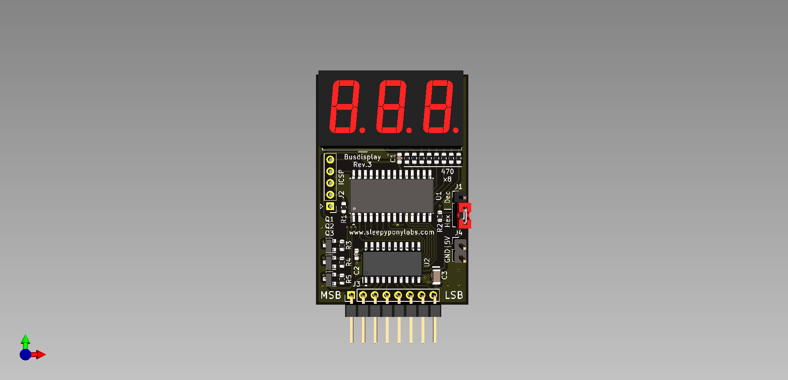

# Busdisplay

This is an open-source KiCad design files for a circuit that could be connected to an 8-bit bus to monitor the value on it in decimal or hexadecimal.

## The board

The board is 33x50mm (perfect for 3x2 panel). Featuring:

- PIC16F570 Microcontroller + ICSP header
- 74HCT245 Transceiver as an input buffer
- 3-digit 7-segment Display
- Hex/Dec Selector Header
- Power and Data Input Headers

We are currently at Revision 3. Changelog is below:

**Revision 3 (June 2021)**

 - Replaced PIC16F57 with PIC16F570, cheaper and more powerful.
 - Removed an external crystal because new PIC now has internal oscillator.
 - Removed buffer chip disable header, nothing shares ICSP pins now.
 - Added a bulk capacitor.
 - Redone the PCB again because new PIC has very different pinout.

**Revision 2 (May 2021)**
 - Added a header to disable the buffer chip, which would then allow the ICSP header to work.
 - Added a pull-up resistor for Selector Header.
 - Replaced HC-49 4MHz crystal with 5032 8Mhz crystal.
 - Replaced an 74HCT244 with 74HCT245 for easier routing.
 - Redone the PCB so every parts are on the top layer, and that the mosfets are not under the display.
 
**Revision 1 (January 2020)**
- Initial Design on [EasyEDA](https://easyeda.com/lsirawit24/8-bit-display)
- This version has several mistakes, for example, the ICSP header does not work, and the pull-up/down resistor is missing on Selector Header.

## What is provided

The goal of this repository is to enable you to build this on your own as easy as possible (although I originally plan to sell this as a kit as well). **I've included all of the schematics, gerbers, BOMs, and display driver firmware for you to use.** 

Hardware is licensed under `SPDX-License-Identifier: Apache-2.0 WITH SHL-2.1`

Software is licensed under `SPDX-License-Identifier: Apache-2.0`

Documentation is licensed under `SPDX-License-Identifier: CC-BY-SA-4.0`

Unfortunately. I have to excluded the 3D models use to render the board in KiCAD because I don't know how each of them was licensed. They are all from GrabCad and you could search and download them by yourself.

**Note: Due to this, there might be a popup warning you about "3D model Search Path" in PCBNew. I honestly don't know how to fix this but it will not affect any KiCAD functionality.**

## Credits

 - 3-digit LED Display model by Robert Dee: https://grabcad.com/library/3-digit-led-display-1
 - Pin header and Jumpers model by singlefonts: https://grabcad.com/library/pin-header-and-jumper-1
 - SOIC package collection by Egor Chugay: https://grabcad.com/library/soic-package-collection-1/details?folder_id=5653384

> Written with [StackEdit](https://stackedit.io/).
